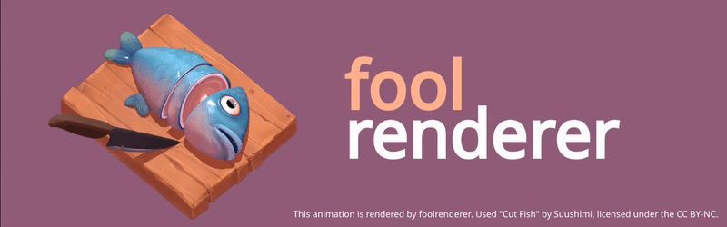
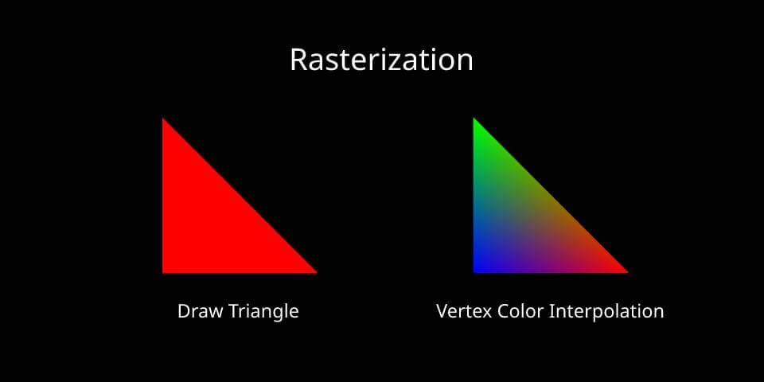
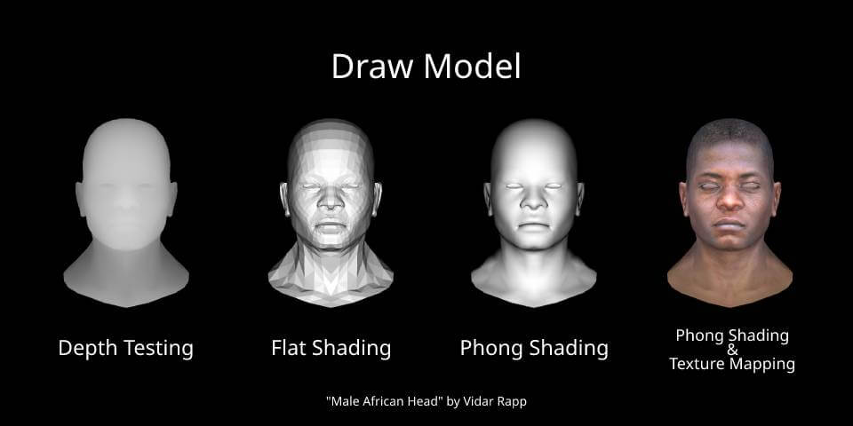
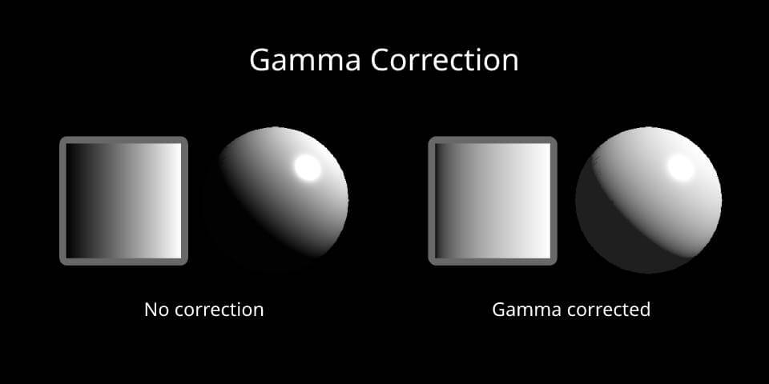
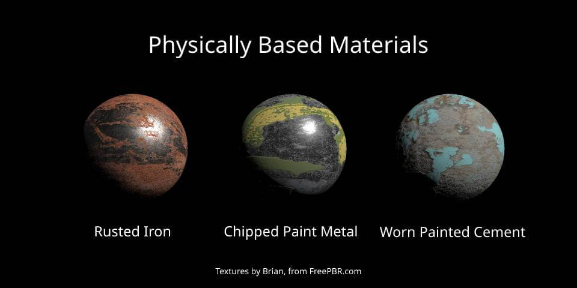

# foolrenderer



**foolrenderer** is a tiny software renderer implemented from scratch without
the use of graphics API, used to understand how GPUs work. The primary goal for
**foolrenderer** is to demonstrate some real-time rendering techniques for video
games.

- **Small.** Only a few thousand lines of code, no complex dependencies.
- **Simple.** Focus on the fundamentals of rendering.
- **Readable.** A quarter of the source code is comments, and every mathematical
calculation has a formula explanation.

## Prerequisites

To build foolrenderer, you must first install the following tools:

### Windows

- Visual Studio 2019 (or more recent)
- CMake 3.5 (or more recent)

### macOS

- Xcode 12.3 (or more recent)
- CMake 3.5 (or more recent)

After installing Xcode you need to make sure the command line tools are set up
by running:

```console
$ xcode-select --install
```

## Build

```console
$ mkdir build
$ cd build
$ cmake ..
$ cmake --build .
```

## Features Showcase









## How to Learn Computer Graphics

Here are some useful literature and videos for self-study computer graphics.
I've also added links to literature on specific problems to the source code.

### Getting Started

- [Grant Sanderson 2016, Essence of linear algebra](https://www.youtube.com/playlist?list=PLZHQObOWTQDPD3MizzM2xVFitgF8hE_ab) -
Learning graphics requires knowing the basic concepts of linear algebra, and
this series of videos will help you enjoy mastering vectors, matrices and other
mathematical tools.
- [Dmitry V. Sokolov 2015, Tiny renderer or how OpenGL works: software rendering in 500 lines of code](https://github.com/ssloy/tinyrenderer) -
An excellent introductory course in computer graphics. After taking this course
you will find that learning OpenGL has become a lot easier.
- [Lingqi Yan 2020, GAMES101: Introduction to Computer Graphics (Chinese course)](https://sites.cs.ucsb.edu/~lingqi/teaching/games101.html) -
Courses cover rasterization, geometry, ray tracing and animation. If you are a
Chinese speaker, this course can help you get started quickly.

### Advanced

- [Joey de Vries 2014, LearnOpenGL](https://learnopengl.com/) -
When you master the basics of graphics, you can easily get started with graphics
APIs such as OpenGL. You can learn advanced features like Shadow Mapping, Gamma
Correction, Normal Mapping, HDR, SSAO and more in this course.
- [Lingqi Yan 2021, GAMES202: Real-Time High Quality Rendering (Chinese course)](https://sites.cs.ucsb.edu/~lingqi/teaching/games202.html) -
The course introduces many real-time rendering techniques widely adopted by the
industry, such as shadows, environment mapping, global illumination, physically
based shading, real-time ray tracing, etc.
- [Grant Sanderson 2017, Essence of calculus](https://www.youtube.com/playlist?list=PLZHQObOWTQDMsr9K-rj53DwVRMYO3t5Yr) -
Watching this series of videos will at least help you understand the rendering
equation.

### Physically Based Rendering

- [Naty Hoffman 2013, Background: Physics and Math of Shading](https://blog.selfshadow.com/publications/s2013-shading-course/hoffman/s2013_pbs_physics_math_notes.pdf)
- [Shree K. Nayar 2021, Radiometry and Reflectance](https://www.youtube.com/playlist?list=PL2zRqk16wsdpyQNZ6WFlGQtDICpzzQ925) -
The first 7 videos of this play list are helpful for understanding Radiometry
and BRDF.
- [Charles de Rousiers & Sébastian Lagarde 2014, Moving Frostbite to PBR](https://www.ea.com/frostbite/news/moving-frostbite-to-pb) -
The EA DICE team detailed the PBR implementation of the Frostbite engine in this
course. Hope the *Battlefield 2042* update goes well.
- [Romain Guy & Mathias Agopian 2018, Physically Based Rendering in Filament](https://google.github.io/filament/Filament.html)

## License

Copyright (c) Caden Ji. All rights reserved.

Licensed under the [MIT](LICENSE) license.
